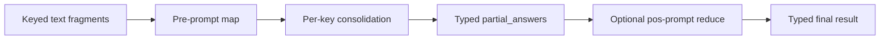

# 🪺 PromptNest

> Typed async map/consolidate/reduce orchestration for LLM applications.

[](https://pypi.org/project/promptnest/)
[](https://pypi.org/project/promptnest/)
[](https://github.com/al4xdev/promptnest/actions/workflows/test.yml)
[](LICENSE)

PromptNest applies one structured prompt to many text fragments concurrently, consolidates
sub-fragments that belong to the same key, and can reduce every typed result into one final
Pydantic model. The orchestration stays independent from the model runtime: OpenAI, LangChain,
LangGraph, CrewAI, or any async callable can sit behind the same adapter contract.



## Install

```fish
pip install promptnest
pip install "promptnest[openai]"
pip install "promptnest[langchain]"
pip install "promptnest[langgraph]"
pip install "promptnest[crewai]"
pip install "promptnest[all]"
```

The core depends only on Pydantic. Framework integrations are optional.

## Quickstart

```python
import asyncio

from openai import AsyncOpenAI
from pydantic import BaseModel

from promptnest import PromptNest
from promptnest.adapters import OpenAIAdapter


class ChunkSummary(BaseModel):
    summary: str
    keywords: list[str]


class FinalReport(BaseModel):
    full_summary: str
    all_keywords: list[str]


async def main() -> None:
    adapter = OpenAIAdapter(AsyncOpenAI(), default_model="gpt-4.1-mini")

    runner = (
        PromptNest.have(
            adapter,
            {
                "introduction": ["First document section..."],
                "details": ["First half...", "Second half..."],
            },
        )
        .set_llm_config(max_completion_tokens=2048)
        .set_retry_config(max_attempts=3, delay_s=1, timeout_s=60)
        .set_concurrency(8)
        .set_pre_prompt(
            "Summarize section {key_text}:\n{chunk_text}",
            ChunkSummary,
            use_key=True,
        )
        .set_pos_prompt(
            "Merge this JSON object into one report:\n{partial_answers}",
            FinalReport,
        )
    )

    await runner.get_chunks_result()
    report = await runner.run_pos_prompt()
    print(report.full_summary)


asyncio.run(main())
```

The keys passed to `have()` are preserved in `runner.partial_answers`. If a key contains multiple
fragments, PromptNest invokes the pre-prompt for each fragment and invokes it once more with their
JSON results to produce one value for that key.

## Framework adapters

### OpenAI and Azure OpenAI

`OpenAIAdapter` accepts either `AsyncOpenAI` or `AsyncAzureOpenAI`. Client construction,
authentication, endpoints, and API versions remain owned by the application.

```python
from openai import AsyncAzureOpenAI
from promptnest.adapters import OpenAIAdapter

client = AsyncAzureOpenAI(
    azure_endpoint="https://example.openai.azure.com",
    api_key="...",
    api_version="2025-04-01-preview",
)
adapter = OpenAIAdapter(client, default_model="deployment-name")
```

### LangChain

The LangChain adapter calls `with_structured_output()` on the injected chat model. Options from
`set_llm_config()` are bound to the model; `config={...}` is forwarded to `ainvoke()`.

```python
from langchain_openai import ChatOpenAI
from promptnest.adapters import LangChainAdapter

adapter = LangChainAdapter(ChatOpenAI(model="gpt-4.1-mini"))
```

### LangGraph

A graph is a runtime rather than a model provider, so the adapter maps each PromptNest call into
graph state and selects the structured value returned by the graph.

```python
from promptnest.adapters import LangGraphAdapter

adapter = LangGraphAdapter(
    compiled_graph,
    input_builder=lambda prompt, model, options: {
        "prompt": prompt,
        "output_schema": model.model_json_schema(),
        **options,
    },
    output_selector=lambda state, model: state["result"],
)
```

The graph may be a local compiled graph or a `RemoteGraph`; it only needs an async `ainvoke`
method. Stateful graphs can receive their thread configuration through
`.set_llm_config(config={"configurable": {"thread_id": "..."}})`.

### CrewAI

The CrewAI adapter receives a factory because the final task normally needs to be configured with
the Pydantic output model requested by PromptNest.

```python
from crewai import Crew
from promptnest.adapters import CrewAIAdapter


def build_crew(output_model):
    final_task.output_pydantic = output_model
    return Crew(agents=agents, tasks=[research_task, final_task])


adapter = CrewAIAdapter(build_crew)
```

PromptNest accepts `CrewOutput.pydantic`, `CrewOutput.json_dict`, or JSON in `CrewOutput.raw`.

### Any async callable

```python
from promptnest.adapters import CallableAdapter


async def invoke(prompt, output_model, **options):
    raw_json = await my_runtime(prompt, schema=output_model.model_json_schema(), **options)
    return raw_json


adapter = CallableAdapter(invoke)
```

The callable may return the requested Pydantic model, another Pydantic model, a dictionary, or a
JSON string.

## Fluent API

| Method | Behavior |
|---|---|
| `PromptNest.have(adapter, chunks)` | Creates a runner from a non-empty keyed mapping of string fragments |
| `set_llm_config(**options)` | Forwards runtime-specific options to every adapter call |
| `set_retry_config(...)` | Sets attempts, delay, and per-attempt timeout |
| `set_concurrency(limit)` | Bounds concurrent adapter calls; `None` is unbounded |
| `set_pre_prompt(...)` | Requires `{chunk_text}` and optionally exposes `{key_text}` |
| `set_pos_prompt(...)` | Requires `{partial_answers}`, supplied as keyed JSON |
| `get_chunks_result(...)` | Executes map and per-key consolidation |
| `run_pos_prompt()` | Executes the final reduce stage |

`discard_defective_chunks=True` retains successful fragments and keys. If every fragment for a key
fails, that key is omitted; if every key fails, `ChunkProcessingError` is raised. Each
`ChunkFailure` identifies the original key, fragment index, and underlying exception.

## Deterministic testing

LLM behavior should not make orchestration tests flaky. The repository includes known JSON
responses that pass through the public adapter and Pydantic validation paths:

```fish
uv run pytest tests/test_json_contract.py
```

It also tests PromptNest as a real consumer after an editable installation:

```fish
uv venv /tmp/promptnest-consumer --seed
/tmp/promptnest-consumer/bin/python -m pip install -e .
/tmp/promptnest-consumer/bin/python -m unittest discover -s consumer_tests -v
```

No network model call is made in either test.

## Development

```fish
uv sync --all-extras --dev
uv run --locked ruff check --no-fix src tests consumer_tests typing_tests
uv run --locked mypy --strict
uv run --locked pytest --strict-config --strict-markers
uv lock --check
uv build --no-sources
uv run --locked twine check --strict dist/*
```

Tags matching `v*` build the distributions and publish them through PyPI Trusted Publishing. The
tag must exactly match the version in `pyproject.toml`.

## License

[MIT](LICENSE)
