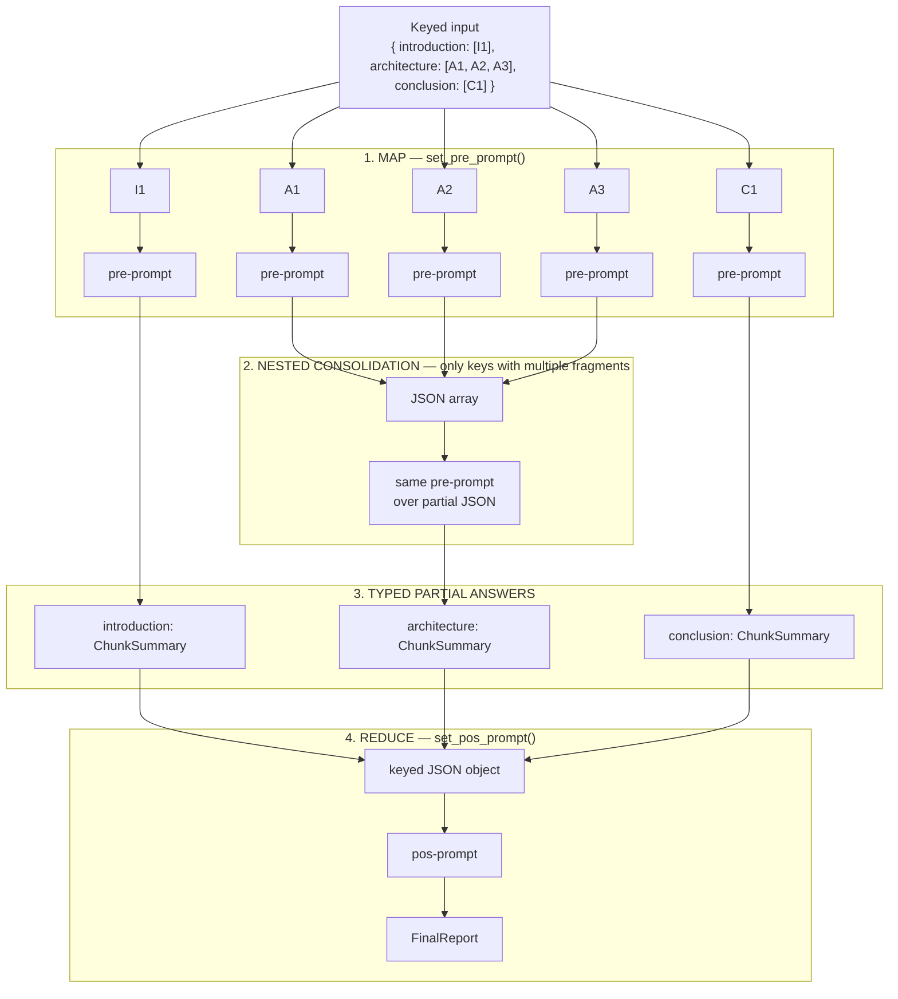
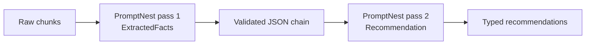

# 🪺 PromptNest

> Typed async nested map/consolidate/reduce orchestration for OpenAI, Azure OpenAI,
> LangChain, LangGraph, CrewAI, and custom LLM runtimes.

[](https://pypi.org/project/promptnest/)
[](https://pypi.org/project/promptnest/)
[](https://github.com/al4xdev/promptnest/actions/workflows/test.yml)
[](https://github.com/al4xdev/promptnest/actions/workflows/certification.yml)
[](LICENSE)

PromptNest applies one structured prompt to many text fragments concurrently, consolidates
sub-fragments that belong to the same key, and can reduce every typed result into one final
Pydantic model. The orchestration stays independent from the model runtime: OpenAI, LangChain,
LangGraph, CrewAI, or any async callable can sit behind the same adapter contract.

## Why I built it

I first developed this pattern at a time when language models had much smaller context windows.
I needed to analyze large source documents and generate long deliverables without losing
consistency between sections. Sending everything in one prompt was either impossible or produced
results that drifted as the document grew.

The solution was a nested map/reduce workflow:

1. split the source into meaningful keyed sections;
2. map a structured prompt over the fragments concurrently;
3. consolidate fragments that belong to the same logical section;
4. reduce the typed section results into one coherent document.

PromptNest is the reusable library extracted from that approach. Pydantic models turn every LLM
boundary into an explicit contract, while the keyed intermediate results preserve document
structure during synthesis. This made it practical to create large documents with more consistent
terminology, coverage, and organization even under tight context limits.

Modern models have larger contexts, but the architecture remains useful. It provides parallelism,
bounded retries, partial-failure handling, typed intermediate artifacts, explicit document
structure, and the ability to inspect or rerun one section without regenerating the whole output.

## Install

```fish
pip install promptnest
pip install "promptnest[openai]"
pip install "promptnest[langchain]"
pip install "promptnest[langgraph]"
pip install "promptnest[crewai]"
pip install "promptnest[all]"
```

The core depends only on Pydantic. Framework integrations are optional.

## Quickstart

```python
import asyncio

from openai import AsyncOpenAI
from pydantic import BaseModel

from promptnest import PromptNest
from promptnest.adapters import OpenAIAdapter


class ChunkSummary(BaseModel):
    summary: str
    keywords: list[str]


class FinalReport(BaseModel):
    full_summary: str
    all_keywords: list[str]


async def main() -> None:
    adapter = OpenAIAdapter(AsyncOpenAI(), default_model="gpt-4.1-mini")

    runner = (
        PromptNest.have(
            adapter,
            {
                "introduction": ["First document section..."],
                "details": ["First half...", "Second half..."],
            },
        )
        .set_llm_config(max_completion_tokens=2048)
        .set_retry_config(max_attempts=3, delay_s=1, timeout_s=60)
        .set_concurrency(8)
        .set_pre_prompt(
            "Summarize section {key_text}:\n{chunk_text}",
            ChunkSummary,
            use_key=True,
        )
        .set_pos_prompt(
            "Merge this JSON object into one report:\n{partial_answers}",
            FinalReport,
        )
    )

    await runner.get_chunks_result()
    report = await runner.run_pos_prompt()
    print(report.full_summary)


asyncio.run(main())
```

The keys passed to `have()` are preserved in `runner.partial_answers`. If a key contains multiple
fragments, PromptNest invokes the pre-prompt for each fragment and invokes it once more with their
JSON results to produce one value for that key.

## Bounded execution and backpressure

PromptNest 0.2 admits logical jobs through a bounded queue and processes them with a fixed worker
pool. `from_async()` allows a lazy producer to be slowed when the queue is full instead of
materializing every job or task in advance:

```python
async def jobs():
    for index in range(10_000):
        yield index, [f"document {index}"]


runner = (
    PromptNest.from_async(adapter, jobs())
    .set_execution_config(workers=32, queue_capacity=128)
    .set_concurrency(16)
    .set_pre_prompt("Extract facts:\n{chunk_text}", ExtractedFacts)
)
await runner.get_chunks_result()
```

`execution_metrics` reports the queue high-watermark, producer admission waits, duration, and
per-provider concurrency/rate-limit waits.

### Independent provider limits

Use `ProviderPool` when one run routes work across multiple providers:

```python
from promptnest import Provider, ProviderPolicy, ProviderPool

pool = ProviderPool(
    {
        "primary": Provider(
            primary_adapter,
            ProviderPolicy(
                max_concurrency=8,
                requests_per_second=10,
                request_burst=2,
                tokens_per_second=20_000,
                token_burst=4_000,
            ),
        ),
        "secondary": Provider(
            secondary_adapter,
            ProviderPolicy(max_concurrency=4),
        ),
    },
    router=lambda context: "primary" if int(context.key) % 2 == 0 else "secondary",
)
```

Routing is stable per invocation context; PromptNest does not silently fail over between providers.

### Jittered retries and durable recovery

```python
from promptnest import RetryPolicy, SQLiteCheckpointStore

runner = (
    runner
    .set_retry_policy(
        RetryPolicy(
            max_attempts=5,
            timeout_s=60,
            base_delay_s=0.5,
            max_delay_s=20,
        )
    )
    .set_checkpoint_store(
        SQLiteCheckpointStore("promptnest-checkpoints.sqlite3"),
        run_id="report-2026-07",
        run_revision="prompts-v1",
    )
)
```

The default new retry policy uses exponential full jitter and respects normalized `Retry-After`
values. SQLite checkpoints allow a later process to reuse validated fragment results and retry
only a failed consolidation. Result recovery is idempotent; an external call that finished before
its checkpoint was committed may be repeated.

## How nested map/reduce works

PromptNest treats the input as a mapping from a meaningful key to one or more text fragments:

```python
chunks = {
    "introduction": ["one complete fragment"],
    "architecture": ["fragment A", "fragment B", "fragment C"],
    "conclusion": ["one complete fragment"],
}
```

Every fragment enters the map stage concurrently. A key containing multiple fragments gets an
additional nested consolidation call before joining the other keys. The optional reduce stage
then receives one JSON object containing all typed per-key results.



For the example above, PromptNest makes five concurrent map calls, one nested consolidation call
for `architecture`, and one final reduce call. The application never has to parse or concatenate
untyped model text: each boundary is validated by the Pydantic model configured for that stage.

### Map only: process and inspect typed partial results

The reduce stage is optional. This is useful for extraction, classification, moderation, or any
batch job where each key is independently valuable.

```python
runner = (
    PromptNest.have(
        adapter,
        {
            "invoice-001": ["Invoice text..."],
            "invoice-002": ["Invoice text..."],
        },
    )
    .set_pre_prompt(
        "Extract invoice fields from:\n{chunk_text}",
        InvoiceData,
    )
)

await runner.get_chunks_result()

invoice = runner.partial_answers["invoice-001"]
if isinstance(invoice, InvoiceData):
    print(invoice.total)
```

### Nested fragments: consolidate one logical section

Fragments under the same key represent one logical unit. PromptNest first maps each fragment and
then sends their structured JSON back through the same pre-prompt to obtain one result.

```python
runner = (
    PromptNest.have(
        adapter,
        {
            "chapter-1": [
                "Pages 1–10...",
                "Pages 11–20...",
                "Pages 21–30...",
            ]
        },
    )
    .set_pre_prompt(
        """
        Summarize this chapter material.
        The input may be original text or a JSON array of partial summaries:

        {chunk_text}
        """,
        ChapterSummary,
    )
)

await runner.get_chunks_result()
chapter = runner.partial_answers["chapter-1"]
```

The pre-prompt should therefore be valid for both raw text and the JSON array used during nested
consolidation.

### Reduce: build one final typed result

`run_pos_prompt()` serializes `partial_answers` as a keyed JSON object and inserts it into
`{partial_answers}`.

```python
runner.set_pos_prompt(
    """
    Produce one report from these section summaries.
    Preserve the relationship between section names and values:

    {partial_answers}
    """,
    FinalReport,
)

report: FinalReport = await runner.run_pos_prompt()
```

### Chain multiple PromptNest passes

`is_chain=True` stores each result as `list[str]` containing validated model JSON. That output can
be passed directly into another runner, creating explicit prompt pipelines without coupling the
library to a specific agent framework.

```python
first = (
    PromptNest.have(adapter, source_chunks)
    .set_pre_prompt("Extract facts:\n{chunk_text}", ExtractedFacts)
)
await first.get_chunks_result(is_chain=True)

second = (
    PromptNest.have(adapter, first.partial_answers)
    .set_pre_prompt(
        "Turn these extracted facts into recommendations:\n{chunk_text}",
        Recommendation,
    )
)
await second.get_chunks_result()
```

This produces two independently typed map stages:



## Framework adapters

### OpenAI and Azure OpenAI

`OpenAIAdapter` accepts either `AsyncOpenAI` or `AsyncAzureOpenAI`. Client construction,
authentication, endpoints, and API versions remain owned by the application.

```python
from openai import AsyncAzureOpenAI
from promptnest.adapters import OpenAIAdapter

client = AsyncAzureOpenAI(
    azure_endpoint="https://example.openai.azure.com",
    api_key="...",
    api_version="2025-04-01-preview",
)
adapter = OpenAIAdapter(client, default_model="deployment-name")
```

### LangChain

The LangChain adapter calls `with_structured_output()` on the injected chat model. Options from
`set_llm_config()` are bound to the model; `config={...}` is forwarded to `ainvoke()`.

```python
from langchain_openai import ChatOpenAI
from promptnest.adapters import LangChainAdapter

adapter = LangChainAdapter(ChatOpenAI(model="gpt-4.1-mini"))
```

### LangGraph

A graph is a runtime rather than a model provider, so the adapter maps each PromptNest call into
graph state and selects the structured value returned by the graph.

```python
from promptnest.adapters import LangGraphAdapter

adapter = LangGraphAdapter(
    compiled_graph,
    input_builder=lambda prompt, model, options: {
        "prompt": prompt,
        "output_schema": model.model_json_schema(),
        **options,
    },
    output_selector=lambda state, model: state["result"],
)
```

The graph may be a local compiled graph or a `RemoteGraph`; it only needs an async `ainvoke`
method. Stateful graphs can receive their thread configuration through
`.set_llm_config(config={"configurable": {"thread_id": "..."}})`.

### CrewAI

The CrewAI adapter receives a factory because the final task normally needs to be configured with
the Pydantic output model requested by PromptNest.

```python
from crewai import Crew
from promptnest.adapters import CrewAIAdapter


def build_crew(output_model):
    final_task.output_pydantic = output_model
    return Crew(agents=agents, tasks=[research_task, final_task])


adapter = CrewAIAdapter(build_crew)
```

PromptNest accepts `CrewOutput.pydantic`, `CrewOutput.json_dict`, or JSON in `CrewOutput.raw`.

### Any async callable

```python
from promptnest.adapters import CallableAdapter


async def invoke(prompt, output_model, **options):
    raw_json = await my_runtime(prompt, schema=output_model.model_json_schema(), **options)
    return raw_json


adapter = CallableAdapter(invoke)
```

The callable may return the requested Pydantic model, another Pydantic model, a dictionary, or a
JSON string.

## Fluent API

| Method | Behavior |
|---|---|
| `PromptNest.have(adapter, chunks)` | Creates a runner from a non-empty keyed mapping of string fragments |
| `set_llm_config(**options)` | Forwards runtime-specific options to every adapter call |
| `set_retry_config(...)` | Sets attempts, delay, and per-attempt timeout |
| `set_concurrency(limit)` | Bounds default-adapter calls; `None` uses the worker count |
| `set_execution_config(...)` | Sets fixed workers and bounded producer queue |
| `set_retry_policy(...)` | Enables classified exponential full-jitter retries |
| `set_checkpoint_store(...)` | Enables durable stage-level recovery |
| `set_pre_prompt(...)` | Requires `{chunk_text}` and optionally exposes `{key_text}` |
| `set_pos_prompt(...)` | Requires `{partial_answers}`, supplied as keyed JSON |
| `get_chunks_result(...)` | Executes map and per-key consolidation |
| `run_pos_prompt()` | Executes the final reduce stage |

`discard_defective_chunks=True` retains successful fragments and keys. If every fragment for a key
fails, that key is omitted; if every key fails, `ChunkProcessingError` is raised. Each
`ChunkFailure` identifies the original key, fragment index, and underlying exception.

## Deterministic testing

LLM behavior should not make orchestration tests flaky. The repository includes known JSON
responses that pass through the public adapter and Pydantic validation paths:

```fish
uv run pytest tests/test_json_contract.py
```

It also tests PromptNest as a real consumer after an editable installation:

```fish
uv venv /tmp/promptnest-consumer --seed
/tmp/promptnest-consumer/bin/python -m pip install -e .
/tmp/promptnest-consumer/bin/python -m unittest discover -s consumer_tests -v
```

No network model call is made in either test.

The repository also includes a reproducible synthetic throughput and latency benchmark. It
documents percentile methodology, comparison limits, why TTFT is not available through the
current structured-output contract, and why bounded concurrency is not complete backpressure:

```fish
uv run python docs/benchmarks/performance.py
```

See [Performance and load testing](docs/performance.md) and the
[local evidence report](docs/performance-evidence.md) before interpreting or publishing results.

The mandatory core profile exercises 10,000 lazy jobs, bounded backpressure, independent provider
limits, token budgets, retries, cancellation, checkpoint recovery, and latency gates:

```fish
uv run promptnest-certify --output-dir /tmp/promptnest-certificate
```

See [Core certification](docs/certification.md) for the exact PASS criteria and claim boundary.

## Development

```fish
uv sync --all-extras --dev
uv run --locked ruff check --no-fix src tests consumer_tests typing_tests
uv run --locked mypy --strict
uv run --locked pytest --strict-config --strict-markers
uv lock --check
uv build --no-sources
uv run --locked twine check --strict dist/*
```

Tags matching `v*` build the distributions and publish them through PyPI Trusted Publishing. The
tag must exactly match the version in `pyproject.toml`.

## License

[MIT](LICENSE)
